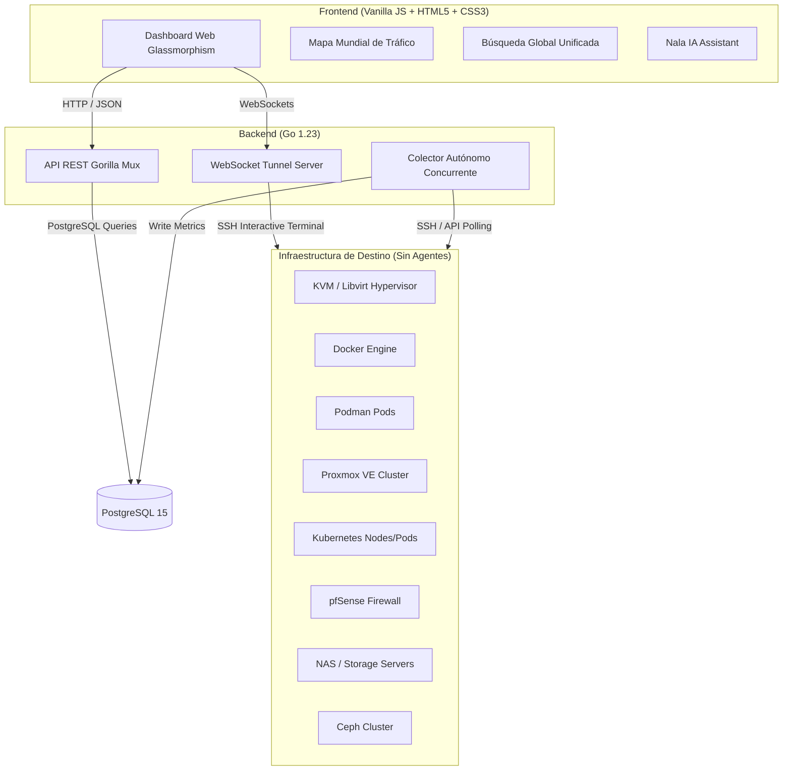

# 🏗️ Arquitectura y Diseño del Sistema

Esta sección describe a fondo la arquitectura de software de **Centralizegg**, el flujo de datos entre capas, los hilos de ejecución concurrente del backend, la estructura relacional de la base de datos PostgreSQL, las API REST disponibles y el stack tecnológico utilizado.

---

## 🏛️ Diseño Multicapa

Centralizegg está diseñado bajo una arquitectura de tres capas desacopladas con colectores independientes en segundo plano para garantizar alta disponibilidad, velocidad de respuesta en el frontend y aislamiento de fallos.



### 🔄 Flujo de Datos General

1. **Colector de Datos (Background Engine)**: Se ejecuta de forma asíncrona cada 5 segundos.
   - Consulta la base de datos para obtener los servidores autorizados.
   - Abre túneles SSH para recopilar telemetría de hipervisores KVM, contenedores Docker/Podman, firewalls pfSense, almacenamiento NAS y Ceph.
   - Resuelve dinámicamente las IPs de los nodos de clústeres Proxmox mediante el comando `pvesh get /cluster/status --output-format json` y realiza la recolección de hardware individual de cada nodo.
   - Persiste la información e historial de telemetría estructurado en esquemas dentro de PostgreSQL.
2. **Consola Web & Snapshots (Interactive Session)**:
   - **Terminal Web**: Se establecen túneles WebSocket bidireccionales (`/api/terminal/{category}/{id}`) que inician sesiones PTY interactivas vía SSH hacia los hipervisores y entornos de contenedores.
   - **Instantáneas**: Llama a APIs que ejecutan comandos nativos de hipervisor (`virsh snapshot-*`) para la gestión de instantáneas virtuales en almacenamiento QCOW2.
3. **API REST (Gorilla Mux)**: Recibe peticiones del frontend y expone la telemetría histórica, configuraciones y logs mediante respuestas comprimidas en GZIP.
4. **Presentación (Frontend Vanilla JS)**: Interfaz de usuario reactiva con sistema de *Memoización* inteligente que compara hashes de estado antes de actualizar el DOM para optimizar el rendimiento del navegador.

---

## ⚙️ Concurrencia y Colector Automático (Go Engine)

Centralizegg aprovecha el modelo de concurrencia nativa de Go para realizar recolecciones de infraestructura masivas sin degradar la respuesta del servidor API:

- **Goroutines Independientes**: Al arrancar la aplicación, se inicia un hilo de ejecución concurrente (`Goroutine`) por cada colector registrado (Docker, pfSense, Proxmox, Ceph, etc.).
- **Diseño No Bloqueante**: Cada colector opera bajo un temporizador (`time.NewTicker`) ajustado a 5 segundos. La recopilación hacia servidores lentos o que estén fuera de línea se ejecuta en paralelo y posee límites de tiempo de espera (*timeouts*) de red, garantizando que un fallo de conexión en un servidor no interfiera ni retarde el monitoreo de los hosts activos restantes.

---

## 🔌 API REST y Endpoints

### 1. Endpoints de Virtualización (KVM)

#### `GET /api/hosts`
Obtiene la lista de todos los hosts KVM monitoreados con sus métricas.
**Respuesta:**
```json
[
  {
    "id": 1,
    "server_id": 1,
    "hostname": "kvm-server-01",
    "server_name": "Production Server 1",
    "ip_address": "192.168.1.100",
    "cpu_model": "Intel Core i7",
    "cpu_cores": 8,
    "total_memory": 17179869184,
    "free_memory": 8589934592,
    "cpu_usage": 45.5,
    "os_name": "Ubuntu 22.04 LTS"
  }
]
```

#### `GET /api/vms`
Obtiene la lista de todas las máquinas virtuales.
**Respuesta:**
```json
[
  {
    "id": 1,
    "name": "web-server-01",
    "state": "Running",
    "vcpu": 2,
    "cpu_time": 1234567890,
    "cpu_usage": 25.3,
    "memory_usage": 2147483648,
    "max_memory": 4294967296,
    "disk_allocation": 10737418240,
    "disk_capacity": 21474836480,
    "disk_read": 1024000,
    "disk_write": 2048000,
    "net_rx": 52428800,
    "net_tx": 104857600,
    "guest_ips": "192.168.1.50, fe80::1",
    "host_id": 1,
    "updated_at": "2026-01-15T10:30:00Z"
  }
]
```

#### Control de VMs KVM
| Endpoint | Método | Descripción |
| :--- | :--- | :--- |
| `/api/kvm/vms/{serverID}/{vmName}/start` | POST | Inicia una VM |
| `/api/kvm/vms/{serverID}/{vmName}/stop` | POST | Detiene una VM |
| `/api/kvm/vms/{id}/{name}/snapshots` | GET | Lista snapshots |
| `/api/kvm/vms/{id}/{name}/snapshot` | POST/DELETE | Crea o Elimina un snapshot |
| `/api/kvm/vms/{id}/{name}/snapshot/revert` | POST | Revierte a un snapshot |

#### Consola Web (WebSockets)
| Endpoint | Protocolo | Descripción |
| :--- | :--- | :--- |
| `/api/terminal/kvm/{serverID}/{vmName}` | WS | Inicia shell interactiva PTY por SSH hacia VM KVM |
| `/api/terminal/docker/{serverID}/{containerID}` | WS | Shell en contenedor Docker |
| `/api/terminal/podman/{serverID}/{containerID}` | WS | Shell en contenedor Podman |
| `/api/terminal/proxmox/{serverID}/{vmID}` | WS | Shell en VM/LXC Proxmox |

---

### 2. Endpoints de Configuración KVM

#### `GET /api/config/servers`
Obtiene la lista de servidores KVM configurados.
**Respuesta:**
```json
[
  {
    "id": 1,
    "name": "Production Server 1",
    "ip_address": "192.168.1.100",
    "ssh_port": 22,
    "username": "root",
    "password": "",
    "ssh_key_path": "/root/.ssh/id_rsa",
    "status": "online"
  }
]
```

#### `POST /api/config/servers`
Agrega un nuevo servidor KVM.
**Request Body:**
```json
{
  "name": "Production Server 1",
  "ip_address": "192.168.1.100",
  "ssh_port": 22,
  "username": "root",
  "password": "optional-password",
  "ssh_key_path": "/root/.ssh/id_rsa"
}
```

---

### 3. Endpoints de Firewall (pfSense)
| Endpoint | Método | Descripción |
| :--- | :--- | :--- |
| `/api/firewall/hosts` | GET | Hosts pfSense con sus métricas activas |
| `/api/firewall/servers` | GET | Servidores pfSense configurados en base de datos |
| `/api/firewall/servers` | POST | Registra un nuevo cortafuegos pfSense |
| `/api/firewall/servers/{id}` | PUT | Actualiza configuraciones del servidor |
| `/api/firewall/servers/{id}` | DELETE | Elimina servidor pfSense |

---

### 4. Endpoints de Contenedores (Docker & Podman)
| Endpoint | Método | Descripción |
| :--- | :--- | :--- |
| `/api/containers/hosts` | GET | Hosts Docker con métricas de sistema |
| `/api/containers/containers` | GET | Listado de todos los contenedores Docker |
| `/api/containers/{serverID}/{containerID}/logs` | GET | Logs de un contenedor Docker |
| `/api/containers/{serverID}/{containerID}/start` | POST | Arranca un contenedor Docker |
| `/api/containers/{serverID}/{containerID}/stop` | POST | Detiene un contenedor Docker |
| `/api/podman/hosts` | GET | Hosts Podman con métricas de sistema |
| `/api/podman/containers` | GET | Listado de todos los contenedores Podman |
| `/api/podman/containers/{serverID}/{containerID}/logs` | GET | Logs de un contenedor Podman |
| `/api/podman/containers/{serverID}/{containerID}/start` | POST | Arranca un contenedor Podman |
| `/api/podman/containers/{serverID}/{containerID}/stop` | POST | Detiene un contenedor Podman |

---

### 5. Endpoints de Kubernetes
| Endpoint | Método | Descripción |
| :--- | :--- | :--- |
| `/api/kubernetes/nodes` | GET | Nodos del cluster Kubernetes |
| `/api/kubernetes/pods` | GET | Todos los pods activos en namespaces |
| `/api/kubernetes/pvs` | GET | Volúmenes persistentes registrados (PVs) |
| `/api/kubernetes/events` | GET | Eventos e incidentes recientes del cluster |
| `/api/kubernetes/pods/{serverID}/{namespace}/{name}/logs` | GET | Logs en tiempo real de un pod específico |

---

### 6. Endpoints de Almacenamiento y Salud
| Endpoint | Método | Descripción |
| :--- | :--- | :--- |
| `/api/nas/hosts` | GET | Servidores NAS monitoreados |
| `/api/nas/volumes` | GET | Volúmenes lógicos y de almacenamiento montados |
| `/api/nas/disks` | GET | Estado SMART de discos físicos individuales |
| `/api/ceph/hosts` | GET | Nodos e información del cluster Ceph |
| `/api/proxmox/hosts` | GET | Nodos Proxmox VE con sus IPs de nodo resueltas |
| `/api/proxmox/vms` | GET | Telemetría de VMs y LXC en clústeres Proxmox |
| `/api/health/summary` | GET | Resumen de salud global para el Dashboard principal |
| `/api/history` | GET | Lista de auditorías de configuración de infraestructura |
| `/api/hosts/{category}/{id}/logs` | GET | Logs del sistema en vivo vía SSH (journalctl) |

---

### 7. Endpoints de Geolocalización & Nala IA

#### `GET /api/geoip/{ip}`
Proxy hacia `ip-api.com` para obtener coordenadas de geolocalización de IPs públicas de conexiones de tráfico.

#### `GET/POST /api/config/nala-ia`
Obtiene o persiste de forma compartida las claves API de Gemini y el prompt de comportamiento del asistente en la base de datos relacional.

---

## 🗄️ Estructura Relacional de la Base de Datos

Centralizegg segmenta los esquemas de PostgreSQL 15 de la siguiente forma para aislar y modularizar la lógica de negocio:

### 1. Esquema `config`
- **`config.app_settings`**: Tabla clave-valor persistente (`key` VARCHAR, `value` JSONB, `updated_at` TIMESTAMP) donde se centralizan las variables compartidas del dashboard (p. ej. la configuración de Nala IA).

### 2. Esquema `virtualization`
- **`virtualization.kvm_servers`**: Almacena las credenciales de conexión SSH, llaves de seguridad y nombres lógicos de los hipervisores KVM.
- **`virtualization.hosts`**: Información técnica (hostname, núcleos, memoria total, uso de CPU) de los hipervisores físicos de KVM.
- **`virtualization.vms`**: Telemetría, tráfico de red, lecturas de disco, IPs invitadas y estado de las VMs en KVM.
- **`virtualization.proxmox_servers`**: Servidores y clústeres Proxmox registrados.
- **`virtualization.proxmox_hosts`**: Nodos individuales descubiertos dinámicamente en Proxmox, incluyendo su hostname y su columna individual `ip_address` real.
- **`virtualization.proxmox_vms`**: Datos de telemetría de VMs y contenedores LXC en Proxmox VE.

### 3. Esquema `firewall`
- **`firewall.pfsense_servers`**: Credenciales SSH de pfSense.
- **`firewall.hosts`**: Telemetría de sistema general de los cortafuegos pfSense.
- **`firewall.interfaces`**: Estadísticas de interfaces de red activas, errores y tasas del cortafuegos.

### 4. Esquema `containers`
- **`containers.docker_servers`** / **`containers.podman_servers`**: Credenciales de acceso SSH.
- **`containers.hosts`** / **`containers.podman_hosts`**: Telemetría general, uso de GPU nvidia, tamaño del directorio `/var/lib/docker` e inodos de los hosts de contenedores.
- **`containers.containers`** / **`containers.podman_containers`**: Estados, puertos mapeados, e imágenes desplegadas de los contenedores activos.

---

## 📁 Estructura del Proyecto

```
Centralizegg/
├── cmd_centralizegg/
│   └── server/
│       └── main.go                 # Punto de entrada de la aplicación Go
├── backend_internal_centralizegg/
│   ├── data_centralizegg/
│   │   └── postgres.go            # Capa de persistencia y consultas SQL
│   ├── virtualization/
│   │   ├── kvm-collector.go       # Recolector de métricas KVM/Libvirt
│   │   └── proxmox-collector.go   # Recolector dinámico de API Proxmox
│   ├── firewall/
│   │   └── pfsense-collector.go   # Recolector pfSense (SSH sin agentes)
│   ├── container/
│   │   ├── docker-collector.go    # Recolector Docker (con GPU y CVE)
│   │   ├── podman-collector.go    # Recolector Podman (icono fa-otter)
│   │   └── kubernetes-collector.go # Recolector de clústeres K8s
│   └── storage/
│       ├── ceph-collector.go      # Recolector de clúster Ceph (SSH)
│       └── nas-collector.go       # Recolector de telemetría NAS (SSH)
├── web_centralizegg/
│   └── static/
│       ├── index.html             # UI HTML5 principal
│       ├── app.js                 # Controlador y router del frontend
│       ├── style.css              # Reglas estéticas de diseño glassmorphism
│       ├── history-map.js         # Lógica de geolocalización en mapa Bezier
│       └── js/                    # ES Modules modulares del frontend
│           ├── api.js             # Peticiones AJAX estructuradas
│           ├── state.js           # Estado global reactivo
│           ├── history.js         # Lógica de gráficos de métricas
│           ├── summary-dashboard.js # Dashboard principal de salud
│           ├── ui-components.js   # Componentes reusables e i18n
│           └── utils.js           # Herramientas de formateo y bytes
```

---

## ⚡ Optimización del Backend y Frontend

### Optimización en Backend (Go)
- **Pool de Conexiones de Base de Datos**: Configurado con `SetMaxOpenConns(25)` y `SetMaxIdleConns(25)` para minimizar latencia en picos de consulta.
- **Conexiones SSH Persistentes**: Reutiliza túneles y clientes de red para evitar la sobrecarga de handshake repetitiva en ciclos de 5 segundos.
- **Compresión GZIP en Vuelo**: Comprime todas las respuestas JSON con la velocidad más eficiente de GZIP (`BestSpeed`) para acelerar la carga en redes móviles o lentas.

### Optimización en Frontend (JS)
- **ES Modules**: Código estructurado y modularizado en archivos enfocados para evitar la sobrecarga de procesamiento en scripts gigantescos.
- **Memoización de UI**: Antes de actualizar las plantillas de visualización en el DOM, se calcula un *hash* de los valores recibidos de CPU, RAM y Estado. Si las métricas no han cambiado, se salta la inyección al DOM (innerHTML) reduciendo a cero el parpadeo visual y el uso innecesario del procesador de la máquina cliente.
