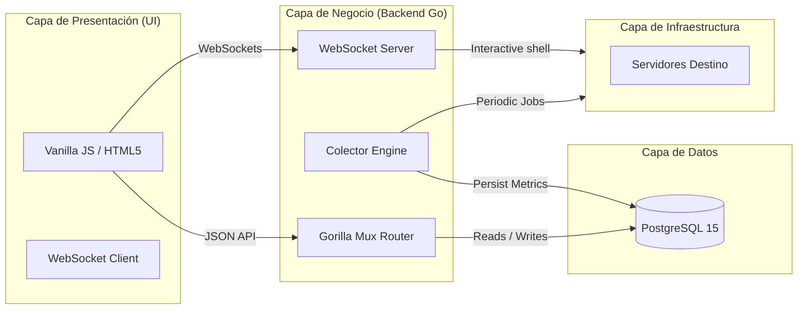

# 🏗️ Arquitectura y Diseño del Sistema

Esta sección describe a fondo la arquitectura de software de **Centralizegg**, el flujo de datos entre capas, los hilos de ejecución concurrente del backend y la estructura relacional de la base de datos PostgreSQL.

---

## 🏛️ Diseño Multicapa

Centralizegg está diseñado bajo una arquitectura de tres capas desacopladas con colectores independientes en segundo plano para garantizar alta disponibilidad, velocidad de respuesta en el frontend y aislamiento de fallos.

---

## 🗄️ Capa de Persistencia (Esquemas de Base de Datos)

La base de datos utiliza **PostgreSQL 15** dividida en esquemas lógicos para aislar la información de cada módulo del sistema:

*   **`virtualization`**: Contiene la telemetría e inventario de hipervisores KVM y nodos de clústeres Proxmox VE:
    - `virtualization.hosts`: Registro físico de servidores KVM.
    - `virtualization.proxmox_hosts`: Servidores físicos Proxmox en clúster (con su hostname e `ip_address` únicos).
    - `virtualization.proxmox_vms`: Máquinas virtuales y contenedores LXC en Proxmox.
*   **`containers`**: Almacena hosts de contenedores y métricas en tiempo real:
    - `containers.hosts`: Hosts Docker.
    - `containers.podman_hosts`: Hosts Podman.
    - `containers.containers` / `containers.podman_containers`: Estado, puertos e imágenes de contenedores.
*   **`kubernetes`**: Estructuras y telemetría de clústeres:
    - `kubernetes.nodes`: Nodos del clúster (CPU, RAM, red).
    - `kubernetes.pods`: Pods desplegados, namespaces e imágenes.
*   **`storage`**: Estructuras de NAS (vías SSH) y clústeres Ceph:
    - `storage.nas_hosts` / `storage.nas_volumes` / `storage.nas_disks`: Discos, particiones e I/O.
    - `storage.ceph_hosts`: Salud de OSDs y monitoreo de Ceph.

---

## ⚙️ Concurrencia y Colector Automático (Go Engine)

Una de las grandes ventajas de Go es su modelo de concurrencia nativa a través de **Goroutines**. Centralizegg aprovecha esto para ejecutar colectores automáticos asíncronos:

- **Goroutines Independientes**: Al iniciar la aplicación, se lanza un hilo de ejecución independiente en segundo plano (`Go Routine`) por cada tipo de infraestructura (KVM, Docker, pfSense, Proxmox, Kubernetes, NAS, Ceph).
- **Ciclo No Bloqueante**: Cada colector corre bajo un temporizador (`time.NewTicker`) configurado a 5 segundos. En cada ciclo:
  - Recupera los servidores autorizados en la base de datos.
  - Ejecuta las conexiones y recopilaciones de forma asíncrona usando hilos de trabajo paralelos.
  - De esta forma, si un host pfSense o un nodo Proxmox está fuera de línea, su retardo de red **no bloquea** la recolección de métricas de los demás servidores.
