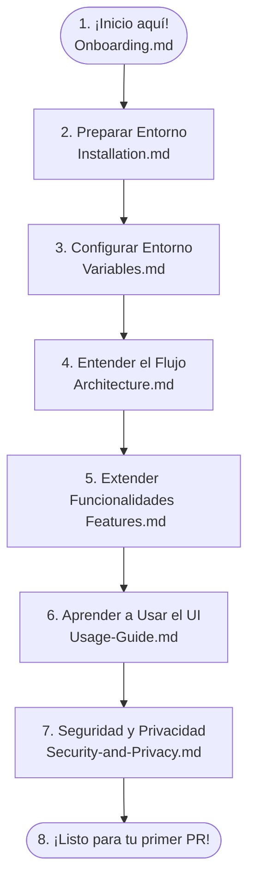

# 🎓 Guía de Onboarding para Nuevos Desarrolladores (Junior-Friendly)

¡Hola! Te damos una cálida bienvenida al equipo de **Centralizegg**. Si estás leyendo esto, significa que eres un nuevo desarrollador o un perfil junior que se incorpora a nuestro equipo. ¡Estamos muy felices de tenerte con nosotros!

Esta guía está diseñada especialmente para ti: explica los conceptos clave de forma sencilla, utiliza analogías del mundo real para la arquitectura, incluye trucos de resolución de problemas comunes y contiene plantillas de código (*boilerplates*) explicadas línea por línea para que puedas empezar a añadir código desde el primer día.

---

## 🗺️ 1. Mapa de Ruta de Inducción (Roadmap)

Sigue este orden recomendado de lectura de la documentación para que tu onboarding sea lo más fluido posible:



---

## 💡 2. Conceptos Básicos y Comandos Clave

Al trabajar en un proyecto hecho en Go (Golang), Docker y JavaScript, verás herramientas y comandos que pueden parecer complejos al principio. Aquí te explicamos los más comunes:

### A. ¿Qué significa `go mod tidy`?
- **Concepto**: En Go, las librerías externas que utilizamos se registran en un archivo llamado `go.mod`.
- **Explicación**: `go mod tidy` es como hacer limpieza en tu habitación. Revisa todo tu código en Go, descarga de internet las librerías que te hagan falta y borra del registro aquellas que ya no se estén utilizando en ningún archivo.
- **Cuándo usarlo**: Ejecútalo en tu terminal siempre que agregues un nuevo `import` de una librería de internet o cuando veas errores de compilación de paquetes faltantes.

### B. ¿Qué es un socket Unix (como `libvirt-sock`)?
- **Analogía**: Imagina que dos personas en la misma casa quieren hablar. Pueden llamarse por teléfono (red TCP/IP) o simplemente hablar en la misma sala (socket Unix).
- **Explicación**: Un socket Unix es un canal de comunicación súper rápido dentro del propio sistema operativo que permite que dos programas en la misma máquina hablen entre sí sin necesidad de abrir puertos de red.

---

## 🏗️ 3. Analogía de la Arquitectura de Centralizegg

Para entender cómo fluyen los datos en Centralizegg, imagina que el sistema es un **Restaurante de Comida de Mar**:

```
[ Cliente en la Mesa ]  <--- (Ordena Comida) --->  [ Camarero (API REST) ]
         ^                                                   |
         | (Plato Preparado)                                 v
[ Cocina Central ]    <--- (Extrae Ingredientes) --->   [ Despensa / Nevera ]
(Colectores SSH/Go)                                    (Base de Datos Postgres)
```

1. **El Cliente (Frontend - Vanilla JS)**: Es la persona sentada a la mesa mirando el menú en su navegador. Pide ver el estado de un servidor o quiere apagar un contenedor Docker.
2. **El Camarero (API REST - Gorilla Mux en Go)**: Toma el pedido del cliente y lo lleva a la cocina. Gestiona las rutas HTTP (como `/api/hosts`) y entrega las respuestas en formato JSON de vuelta a la mesa.
3. **La Cocina (Colector Autónomo - Goroutines en Go)**: En la cocina hay chefs (rutinas concurrentes) que trabajan cada 5 segundos. Hacen llamadas vía SSH o API a los servidores reales (los ingredientes) para procesar las métricas de CPU, RAM y Red.
4. **La Nevera (Base de Datos - PostgreSQL)**: La base de datos es donde se almacenan los ingredientes (telemetría e historial) de forma organizada en estantes (esquemas) para que los chefs y camareros puedan consultarlos rápidamente.

---

## 🛠️ 4. Plantillas de Código Base (Boilerplates Comentados)

Para ayudarte a realizar tus primeras tareas, aquí tienes plantillas con explicaciones línea por línea de cómo modificar o añadir funcionalidades en Centralizegg:

### A. Cómo añadir un nuevo Endpoint API en el Backend
Ubicación del archivo: `cmd_centralizegg/server/main.go`

```go
// 1. Definimos una función handler que procesará la petición HTTP
r.HandleFunc("/api/ejemplo", func(w http.ResponseWriter, r *http.Request) {
    // 2. Cabecera HTTP: Le decimos al navegador que la respuesta será un JSON
    w.Header().Set("Content-Type", "application/json")
    
    // 3. Creamos un mapa (clave-valor) con los datos que deseamos retornar
    respuesta := map[string]string{
        "status":  "ok",
        "mensaje": "¡Hola! Has creado tu primer endpoint en Centralizegg",
    }
    
    // 4. Codificamos el mapa a formato JSON y lo escribimos en la respuesta web
    json.NewEncoder(w).Encode(respuesta)
    
// 5. Especificamos que este endpoint solo responde a peticiones GET
}).Methods("GET")
```

### B. Cómo añadir una nueva Consulta a la Base de Datos
Ubicación del archivo: `backend_internal_centralizegg/data_centralizegg/postgres.go`

```go
// 1. Definimos una función en el struct DB para que sea accesible en todo el backend
func (d *DB) ObtenerEstadoServidor(serverID int64) (string, error) {
    // 2. Definimos una variable local para guardar el resultado de la base de datos
    var status string
    
    // 3. Escribimos la consulta SQL. USAMOS $1 para pasar el parámetro de forma segura (Evita SQL Injection)
    query := "SELECT status FROM virtualization.proxmox_hosts WHERE id = $1"
    
    // 4. Ejecutamos la consulta y escaneamos el resultado directo en nuestra variable
    err := d.Conn.QueryRow(query, serverID).Scan(&status)
    if err != nil {
        // Retornamos el error si la consulta falló (ej. no existe el ID)
        return "", err
    }
    
    // 5. Retornamos el estado leído y un valor 'nil' para indicar que no hubo errores
    return status, nil
}
```

### C. Cómo añadir un String Multilingüe (i18n)
Ubicación del archivo: `web_centralizegg/static/app.js` (o módulo de traducción)

1. **En la sección de Español (`translationsES`)**:
   ```javascript
   const translationsES = {
       // ... tus claves anteriores
       onboarding_alert: "Alerta de prueba de inducción"
   };
   ```
2. **En la sección de Inglés (`translationsEN`)**:
   ```javascript
   const translationsEN = {
       // ... tus claves anteriores
       onboarding_alert: "Onboarding test alert"
   };
   ```
3. **En la sección de Portugués (`translationsPT`)**:
   ```javascript
   const translationsPT = {
       // ... tus claves anteriores
       onboarding_alert: "Alerta de teste de integração"
   };
   ```
4. **Uso en el Frontend JavaScript**:
   ```javascript
   // Inyectar en HTML usando la función de idioma activa
   const msg = getTranslation(state.currentLanguage, 'onboarding_alert');
   ```

---

## 🚨 5. Solución de Problemas Frecuentes (Troubleshooting)

### 1. Error: `port 8080 is already allocated`
- **Por qué pasa**: Otro programa en tu ordenador (como otro servidor web local) ya está ocupando el puerto `8080`.
- **Solución**: Abre el archivo `docker-compose.yml` en la raíz del proyecto y cambia el puerto del host (el primer número) por uno libre, por ejemplo el `9090`:
  ```yaml
  ports:
    - "9090:8080"
  ```
  Guarda el archivo y vuelve a ejecutar `docker-compose up -d`. Ahora podrás ver la UI ingresando a `http://localhost:9090`.

### 2. Error: `Permission denied (publickey)`
- **Por qué pasa**: El contenedor no tiene acceso a tu clave privada de SSH, o tu clave no está autorizada en el servidor destino.
- **Solución**:
  1. Abre tu terminal local y ejecuta `ssh-add ~/.ssh/id_rsa` para registrar la clave.
  2. Asegúrate de que el contenido de tu clave pública (`~/.ssh/id_rsa.pub`) esté copiado dentro del archivo `/root/.ssh/authorized_keys` de la máquina que quieres monitorear.
