# Centralizegg

<div align="center">
  
</div>

<div align="center">
  
</div>

[🇨🇴 Español](#español) | 

---

<a name="español"></a>
# 🇨🇴 Centralizegg

**Centralizegg** es una solución de monitoreo ligera y containerizada para múltiples servidores y servicios. Proporciona un dashboard premium en tiempo real para visualizar los recursos de tus hosts, contenedores y Clusters K8s, permitiendo ver el estado de los recursos de forma centralizada.

## 📋 Tabla de Contenidos


- [Arquitectura](#-arquitectura)
- [API REST](#-api-rest)
- [Base de Datos](#-base-de-datos)
- [Funcionalidades del Frontend](#-funcionalidades-del-frontend)
- [Desarrollo](#-desarrollo)
- [Tech Stack](#tech-stack)


## 🏗️ Arquitectura

Centralizegg sigue una arquitectura de tres capas: Frontend, Backend API y Base de Datos, con colectores de datos independientes que se ejecutan en segundo plano para cada tipo de infraestructura.

```mermaid
graph TD
    subgraph Frontend["Frontend (Vanilla JS)"]
        UI[Dashboard Web]
        Search[Búsqueda Global]
        Config[Configuración UI]
        AlertEngine[Alertas Audibles]
        SummaryDash[Summary Dashboard]
    end

    subgraph Backend["Backend (Go)"]
        API[API REST<br/>Gorilla Mux]
        Collector[Colector Unificado]
        Libvirt[Libvirt Client]
        SSH["SSH Client"]
        Docker["Docker Client"]
        Podman["Podman Client (fa-otter)"]
        K8s["K8s Client"]
        Prox["Proxmox Client"]
        pfSense["pfSense Client"]
        NAS["NAS Client (SSH)"]
        Ceph["Ceph Client (SSH)"]
        VolumeSvc[Servicio de Tamaño de Volúmenes]
        AlertSvc[Servicio de Alertas]
    end

    subgraph Database["Base de Datos"]
        PG[(PostgreSQL 15)]
        SchemaVirt[Esquema virtualization]
        SchemaFW[Esquema firewall]
        SchemaStore[Esquema storage]
        SchemaCont[Esquema containers]
        SchemaK8s[Esquema kubernetes]
    end

    subgraph Remote["Servidores Remotos"]
        KVM1[KVM Server]
        Prox1[Proxmox Node]
        K8s1[K8s Cluster]
        Dock1[Docker Host]
        Pod1[Podman Host]
        pfSense1[pfSense Gateway]
        NAS1[NAS Server]
        Ceph1[Ceph Cluster]
    end

    UI -- "HTTP Requests" --> API
    Search -- "HTTP Requests" --> API
    Config -- "HTTP Requests" --> API
    SummaryDash -- "HTTP Requests" --> API
    AlertEngine -- "Triggers" --> UI
    API -- "Query/Insert/Update" --> PG

    Collector -- "Query" --> PG
    Collector -- "SSH/Libvirt" --> Libvirt
    Libvirt -- "KVM" --> KVM1

    Collector -- "SSH/API" --> Prox
    Prox -- "Proxmox Node" --> Prox1

    Collector -- "KubeAPI" --> K8s
    K8s -- "K8s Cluster" --> K8s1

    Collector -- "Docker API" --> Docker
    Docker -- "Docker Host" --> Dock1

    Collector -- "Podman API" --> Podman
    Podman -- "Podman Host" --> Pod1

    Collector -- "pfSense SSH" --> pfSense
    pfSense -- "pfSense Gateway" --> pfSense1

    Collector -- "NAS SSH" --> NAS
    NAS -- "NAS Server" --> NAS1

    Collector -- "Ceph SSH" --> Ceph
    Ceph -- "Ceph Cluster" --> Ceph1

    Collector -- "Volume Size" --> VolumeSvc
    VolumeSvc -- "Store/Query" --> PG

    Collector -- "Alert Events" --> AlertSvc
    AlertSvc -- "Notify" --> AlertEngine

    Collector -- "Upsert Data" --> PG
    PG -- "Response" --> API
    API -- "JSON Response" --> UI
```



### Flujo de Datos

1. **Colector de Datos**: Se ejecuta cada 5 segundos en segundo plano (8 colectores independientes)
   - **KVM**: Conexión SSH + túnel Libvirt (`/var/run/libvirt/libvirt-sock`), recopila métricas de host y VMs
   - **Docker**: Conexión SSH al Docker Engine, estadísticas de contenedores, GPU, CVE
   - **Podman**: Conexión SSH al Podman Engine, similar a Docker
   - **Kubernetes**: Conexión vía `kubectl`, nodos, pods, PVs, eventos
   - **pfSense**: Conexión SSH, métricas de sistema e interfaces
   - **Proxmox**: Conexión SSH/API, nodos, VMs y LXC
   - **NAS**: Conexión SSH, discos, volúmenes, I/O
   - **Ceph**: Conexión SSH, estado del cluster, OSDs, pools
   - Almacena/actualiza datos en PostgreSQL

2. **Historial Global & Logs**:
   - Visualización histórica de CPU, Memoria, Red y Disco.
   - **Historial Detallado por Nodo (Kubernetes)**: Métricas individuales para nodos de cluster.
   - **Métricas de I/O de Disco**: Tasas de lectura/escritura por disco físico.
   - **Logs del Host**: Visualización de logs del sistema (`journalctl`/`clog`) en tiempo real vía SSH.
   - Soporta categorías: `kvm`, `docker`, `podman`, `kubernetes`, `pfsense`, `proxmox`, `nas`, `ceph`.

3. **Mapa de Geolocalización**:
   - Visualización de conexiones activas en un mapa mundial interactivo.
   - **Heatmap**: Densidad de tráfico con gradiente de colores.
   - **Filtros Interactivos**: All/Inbound/Outbound para segmentar conexiones.
   - **Líneas Dinámicas (Ant-Path)**: Velocidad proporcional al volumen de tráfico.
   - **Marcadores Pulsantes**: Rojo (entrante) y Verde (saliente) con popup detallado.

4. **API REST**: Procesa peticiones del frontend
   - `GET /api/hosts` - Retorna hosts con información completa
   - `GET /api/vms` - Retorna todas las VMs
   - `GET /api/hosts/{category}/{id}/logs` - Obtiene logs del sistema del host
   - `GET/POST/PUT/DELETE /api/config/servers` - Gestión de servidores KVM
   - `GET /api/geoip/{ip}` - Proxy a ip-api.com para geolocalización
   - `GET /api/status` - Estado del sistema (CPU, memoria, uptime, versión)
   - `GET /api/health/summary` - Estado de salud global de la infraestructura
   - `GET /api/history` - Eventos históricos (últimos 50)

5. **Frontend**: Interfaz de usuario reactiva
   - Auto-refresh cada 5 segundos
   - Búsqueda en tiempo real
   - Filtrado por host seleccionado
   - Popovers interactivos para métricas detalladas
   - Dashboard de salud global

## 📁 Estructura del Proyecto

```
Centralizegg/
├── cmd_centralizegg/
│   └── server/
│       └── main.go                 # Punto de entrada (882 líneas, rutas API, middlewares)
├── backend_internal_centralizegg/
│   ├── data_centralizegg/
│   │   └── postgres.go            # Capa de acceso a datos (PostgreSQL, 2615 líneas)
│   ├── virtualization/
│   │   ├── kvm-collector.go       # Colector de métricas KVM/Libvirt
│   │   └── proxmox-collector.go   # Colector de API Proxmox
│   ├── firewall/
│   │   └── pfsense-collector.go   # Colector de métricas pfSense (SSH)
│   ├── container/
│   │   ├── docker-collector.go    # Colector Docker
│   │   ├── podman-collector.go    # Colector Podman
│   │   └── kubernetes-collector.go # Colector K8s
│   └── storage/
│       ├── ceph-collector.go      # Colector Ceph (SSH)
│       └── nas-collector.go       # Colector NAS (SSH)
├── web_centralizegg/
│   └── static/
│       ├── index.html             # Interfaz principal
│       ├── app.js                 # Lógica del frontend (monolito, 449KB)
│       ├── style.css              # Estilos glassmorphism
│       ├── history-map.js         # Módulo de mapa de historial
│       ├── favicon.ico            # Icono del sitio
│       ├── js/                    # Módulos ES modulares
│       │   ├── api.js             # Funciones de fetch centralizadas
│       │   ├── state.js           # Estado global (Single Source of Truth)
│       │   ├── history.js         # Lógica de historial y gráficos
│       │   ├── summary-dashboard.js # Dashboard de salud global
│       │   ├── tool-kvm.js        # Renderizado y control KVM
│       │   ├── ui-components.js   # Componentes UI reutilizables
│       │   └── utils.js           # Utilidades (formatBytes, etc.)
│       ├── docs/                  # Documentación embebida (HTML)
│       │   ├── virtualization.html
│       │   ├── containers.html
│       │   ├── firewall.html
│       │   ├── kubernetes.html
│       │   ├── storage.html
│       │   └── performance.html
│       ├── logo.png
│       └── image/
│           └── 1.png              # Screenshot del dashboard
├── deploy_centralizegg/
│   └── postgres/
│       └── init.sql               # Script de inicialización de BD
├── docker-compose.yml             # Configuración de servicios
├── Dockerfile                     # Imagen multi-stage del contenedor
├── go.mod                         # Dependencias Go 1.23.2
└── README.md
```

## 🔌 API REST

Centralizegg expone una API REST para acceder a los datos y gestionar la configuración. Todas las respuestas API son comprimidas con GZIP automáticamente.

### Endpoints de Virtualización (KVM)

#### `GET /api/hosts`

Obtiene la lista de todos los hosts KVM monitoreados con sus métricas.

**Respuesta:**
```json
[
  {
    "id": 1,
    "server_id": 1,
    "hostname": "kvm-server-01",
    "server_name": "Production Server 1",
    "ip_address": "192.168.1.100",
    "cpu_model": "Intel Core i7",
    "cpu_cores": 8,
    "total_memory": 17179869184,
    "free_memory": 8589934592,
    "cpu_usage": 45.5,
    "os_name": "Ubuntu 22.04 LTS"
  }
]
```

#### `GET /api/vms`

Obtiene la lista de todas las máquinas virtuales.

**Respuesta:**
```json
[
  {
    "id": 1,
    "name": "web-server-01",
    "state": "Running",
    "vcpu": 2,
    "cpu_time": 1234567890,
    "cpu_usage": 25.3,
    "memory_usage": 2147483648,
    "max_memory": 4294967296,
    "disk_allocation": 10737418240,
    "disk_capacity": 21474836480,
    "disk_read": 1024000,
    "disk_write": 2048000,
    "net_rx": 52428800,
    "net_tx": 104857600,
    "guest_ips": "192.168.1.50, fe80::1",
    "guest_fs_usage": "",
    "host_id": 1,
    "updated_at": "2026-01-15T10:30:00Z"
  }
]
```

#### Control de VMs KVM

| Endpoint | Método | Descripción |
|----------|--------|-------------|
| `/api/kvm/vms/{serverID}/{vmName}/start` | POST | Inicia una VM |
| `/api/kvm/vms/{serverID}/{vmName}/stop` | POST | Detiene una VM |

### Endpoints de Configuración KVM

#### `GET /api/config/servers`

Obtiene la lista de servidores KVM configurados.

**Respuesta:**
```json
[
  {
    "id": 1,
    "name": "Production Server 1",
    "ip_address": "192.168.1.100",
    "ssh_port": 22,
    "username": "root",
    "password": "",
    "ssh_key_path": "/root/.ssh/id_rsa",
    "status": "online"
  }
]
```

#### `POST /api/config/servers`

Agrega un nuevo servidor KVM.

**Request Body:**
```json
{
  "name": "Production Server 1",
  "ip_address": "192.168.1.100",
  "ssh_port": 22,
  "username": "root",
  "password": "optional-password",
  "ssh_key_path": "/root/.ssh/id_rsa"
}
```

**Respuesta:**
```json
{
  "id": 1,
  "name": "Production Server 1",
  "ip_address": "192.168.1.100",
  "ssh_port": 22,
  "username": "root",
  "password": "",
  "ssh_key_path": "/root/.ssh/id_rsa",
  "status": "unknown"
}
```

#### `PUT /api/config/servers/{id}`

Actualiza la configuración de un servidor existente.

**Request Body:**
```json
{
  "name": "Production Server 1 Updated",
  "ip_address": "192.168.1.100",
  "ssh_port": 2222,
  "username": "admin",
  "password": "",
  "ssh_key_path": "/root/.ssh/id_rsa"
}
```

**Nota**: Si `password` está vacío, no se actualizará la contraseña existente. Si `ssh_key_path` está vacío, se aplica el default `/root/.ssh/id_rsa`.

#### `DELETE /api/config/servers/{id}`

Elimina un servidor de la configuración.

**Respuesta**: `200 OK`

### Endpoints de Firewall (pfSense)

| Endpoint | Método | Descripción |
|----------|--------|-------------|
| `/api/firewall/hosts` | GET | Hosts pfSense con métricas |
| `/api/firewall/servers` | GET | Servidores pfSense configurados |
| `/api/firewall/servers` | POST | Agrega servidor pfSense |
| `/api/firewall/servers/{id}` | PUT | Actualiza servidor pfSense |
| `/api/firewall/servers/{id}` | DELETE | Elimina servidor pfSense |

---

### Endpoints de Contenedores

| Endpoint | Método | Descripción |
|----------|--------|-------------|
| `/api/containers/hosts` | GET | Hosts Docker con métricas |
| `/api/containers/containers` | GET | Todos los contenedores Docker |
| `/api/containers/{serverID}/{containerID}/logs` | GET | Logs de un contenedor Docker |
| `/api/containers/{serverID}/{containerID}/start` | POST | Iniciar contenedor Docker |
| `/api/containers/{serverID}/{containerID}/stop` | POST | Detener contenedor Docker |
| `/api/podman/hosts` | GET | Hosts Podman con métricas |
| `/api/podman/containers` | GET | Todos los contenedores Podman |
| `/api/podman/containers/{serverID}/{containerID}/logs` | GET | Logs de un contenedor Podman |
| `/api/podman/containers/{serverID}/{containerID}/start` | POST | Iniciar contenedor Podman |
| `/api/podman/containers/{serverID}/{containerID}/stop` | POST | Detener contenedor Podman |

### Endpoints de Kubernetes

| Endpoint | Método | Descripción |
|----------|--------|-------------|
| `/api/kubernetes/nodes` | GET | Nodos del cluster |
| `/api/kubernetes/pods` | GET | Todos los pods |
| `/api/kubernetes/pvs` | GET | Persistent Volumes |
| `/api/kubernetes/events` | GET | Eventos recientes del cluster |
| `/api/kubernetes/pods/{serverID}/{namespace}/{name}/logs` | GET | Logs de un pod específico |

### Endpoints de Almacenamiento

| Endpoint | Método | Descripción |
|----------|--------|-------------|
| `/api/nas/hosts` | GET | Servidores NAS |
| `/api/nas/volumes` | GET | Volúmenes lógicos |
| `/api/nas/disks` | GET | Discos físicos (S.M.A.R.T) |
| `/api/ceph/hosts` | GET | Nodos del cluster Ceph |
| `/api/proxmox/hosts` | GET | Nodos Proxmox |
| `/api/proxmox/vms` | GET | VMs y LXC de Proxmox |

### Endpoints de Salud y Métricas

| Endpoint | Método | Descripción |
|----------|--------|-------------|
| `/api/health/summary` | GET | Estado de salud global de la infraestructura |
| `/api/history` | GET | Eventos históricos (últimos 50) |
| `/api/metrics/{category}/{id}?duration=24h` | GET | Métricas históricas por servidor |
| `/api/hosts/{category}/{id}/logs` | GET | Logs del sistema del host |
| `/api/status` | GET | Estado del sistema (CPU, memoria, uptime, versión) |

**Categorías soportadas para logs/métricas:** `kvm`, `docker`, `podman`, `kubernetes`, `pfsense`, `proxmox`, `nas`, `ceph`

### Endpoint de Geolocalización

#### `GET /api/geoip/{ip}`

Proxy hacia ip-api.com para obtener datos de geolocalización. Soporta `self` para obtener la IP pública del servidor.

**Respuesta:**
```json
{
  "status": "success",
  "country": "Colombia",
  "countryCode": "CO",
  "city": "Bogotá",
  "lat": 4.6097,
  "lon": -74.0817
}
```

### Endpoint de Configuración Genérica

#### `GET/POST /api/config/{tool}`
#### `PUT/DELETE /api/config/{tool}/{id}`

Endpoint genérico para gestionar servidores de herramientas soportadas: `proxmox`, `nas`, `ceph`, `docker`, `podman`, `kubernetes`.

## 🗄️ Base de Datos

Centralizegg utiliza PostgreSQL 15 con 5 esquemas dedicados: `virtualization`, `firewall`, `storage`, `containers` y `kubernetes`.

### Esquema `virtualization`

#### Tabla: `virtualization.kvm_servers`

Almacena la configuración de los servidores KVM.

| Columna | Tipo | Descripción |
|---------|------|-------------|
| `id` | SERIAL | ID único |
| `name` | VARCHAR(255) | Nombre descriptivo |
| `ip_address` | VARCHAR(255) | Dirección IP |
| `ssh_port` | INT | Puerto SSH (default: 22) |
| `username` | VARCHAR(255) | Usuario SSH |
| `password` | VARCHAR(255) | Contraseña (opcional) |
| `ssh_key_path` | VARCHAR(255) | Ruta a la clave SSH |
| `status` | VARCHAR(50) | Estado: online, offline, unknown |
| `created_at` | TIMESTAMP | Fecha de creación |

#### Tabla: `virtualization.hosts`

Almacena información de los hosts físicos.

| Columna | Tipo | Descripción |
|---------|------|-------------|
| `id` | SERIAL | ID único |
| `server_id` | INT | FK a `kvm_servers.id` |
| `hostname` | VARCHAR(255) | Nombre del host |
| `cpu_model` | VARCHAR(255) | Modelo de CPU |
| `cpu_cores` | INT | Número de cores |
| `total_memory` | BIGINT | Memoria total (bytes) |
| `free_memory` | BIGINT | Memoria libre (bytes) |
| `cpu_usage` | DOUBLE PRECISION | Uso de CPU (%) |
| `os_name` | VARCHAR(255) | Nombre del SO |
| `created_at` | TIMESTAMP | Fecha de creación |

#### Tabla: `virtualization.vms`

Almacena información de las máquinas virtuales.

| Columna | Tipo | Descripción |
|---------|------|-------------|
| `id` | SERIAL | ID único |
| `name` | VARCHAR(255) | Nombre de la VM |
| `state` | VARCHAR(50) | Estado: Running, Blocked, Paused, etc. |
| `vcpu` | INT | Número de vCPUs |
| `cpu_time` | BIGINT | Tiempo de CPU acumulado (ns) |
| `cpu_usage` | DOUBLE PRECISION | Uso de CPU (%) |
| `memory_usage` | BIGINT | Memoria utilizada (bytes) |
| `max_memory` | BIGINT | Memoria máxima (bytes) |
| `disk_allocation` | BIGINT | Disco asignado (bytes) |
| `disk_capacity` | BIGINT | Capacidad de disco (bytes) |
| `disk_read` | BIGINT | Bytes leídos |
| `disk_write` | BIGINT | Bytes escritos |
| `net_rx` | BIGINT | Tráfico recibido (bytes) |
| `net_tx` | BIGINT | Tráfico enviado (bytes) |
| `guest_ips` | TEXT | IPs del guest (QEMU Agent) |
| `guest_fs_usage` | TEXT | Uso de filesystem (reservado) |
| `host_id` | INT | FK a `hosts.id` |
| `updated_at` | TIMESTAMP | Última actualización |

#### Tabla: `virtualization.proxmox_servers`

Almacena configuración de servidores Proxmox (misma estructura que `kvm_servers`).

### Relaciones

- `hosts.server_id` → `kvm_servers.id` (ON DELETE CASCADE)
- `vms.host_id` → `hosts.id` (ON DELETE CASCADE)

### Índices

- `idx_vms_name` en `vms.name`
- `idx_hosts_server` en `hosts.server_id`

### Esquema `firewall`

#### Tabla: `firewall.pfsense_servers`
Almacena configuración de servidores pfSense (similar a `kvm_servers`).

#### Tabla: `firewall.hosts`
Almacena métricas de hosts pfSense (CPU, Memoria, tráfico de red RX/TX total y por segundo).

#### Tabla: `firewall.interfaces`
Almacena estadísticas de interfaces de red de pfSense (bytes, paquetes, errores, dropped por dirección).

**Índices:**
- `idx_firewall_hosts_server` en `firewall.hosts(server_id)`
- `idx_firewall_interfaces_host` en `firewall.interfaces(host_id)`

### Esquema `storage`

#### Tabla: `storage.nas_servers`
Configuración de servidores NAS (misma estructura que `kvm_servers`).

#### Tabla: `storage.ceph_servers`
Configuración de servidores Ceph (misma estructura que `kvm_servers`).

> **Nota**: Las tablas adicionales de NAS (`nas_hosts`, `nas_volumes`, `nas_disks`) y Ceph son creadas dinámicamente por los colectores al ejecutarse por primera vez.

### Esquema `containers`

#### Tabla: `containers.docker_servers`
Configuración de servidores Docker (misma estructura que `kvm_servers`).

#### Tabla: `containers.podman_servers`
Configuración de servidores Podman (misma estructura que `kvm_servers`).

> **Nota**: Las tablas adicionales de hosts y contenedores Docker/Podman (`containers.hosts`, `containers.containers`, `containers.podman_hosts`, `containers.podman_containers`) son creadas dinámicamente por los colectores, incluyendo campos para métricas de GPU (`gpu_info`), vulnerabilidades y almacenamiento.

### Esquema `kubernetes`

> **Nota**: Todas las tablas de Kubernetes (`kubernetes.nodes`, `kubernetes.pods`, `kubernetes.pvs`, `kubernetes.events`) son creadas dinámicamente por el colector K8s al ejecutarse por primera vez.


## 🎨 Funcionalidades del Frontend

### Interfaz de Usuario

- **Diseño Glassmorphism**: Efecto de vidrio esmerilado con tema oscuro
- **Responsive**: Adaptable a diferentes tamaños de pantalla
- **Animaciones**: Transiciones suaves y efectos visuales

### Características Principales

1. **Dashboard de Salud Global**
   - Panel resumen con visión general del estado de toda la infraestructura
   - Métricas agregadas de hosts, VMs, contenedores y pods
   - Implementado en `js/summary-dashboard.js`

2. **Búsqueda Global**
   - Búsqueda en tiempo real de hosts y VMs
   - Sugerencias con navegación por teclado (↑↓ Enter)
   - Filtrado instantáneo de resultados

3. **Visualización de Hosts**
   - Tarjetas con métricas de CPU, memoria y disco
   - **Layout Optimizado**: Información dividida en dos columnas: **Sistema y Red** (OS, Uptime, Temperatura, IPs y Bridges) ubicado en la columna izquierda, y **Almacenamiento** (Gráficos de disco y alertas OOM) en la derecha.
       - **Sistema y Red**: OS, Uptime, Temperatura, IPs y Bridges.
       - **Almacenamiento**: Gráficos de disco (Donut Charts) y alertas OOM.
   - Indicadores de estado (online/offline)
   - Iconos de SO según distribución detectada
    - **Historial Global & Logs del Host**:
        - Dashboard de historial con selección dinámica de servidores.
        - **Logs en Vivo**: Terminal integrada para visualizar logs de sistema vía SSH (`journalctl`/`clog`).
        - **Gráficos de Red con Umbrales**: Líneas discontinuas que indican el límite de velocidad de la interfaz.
        - **Unidades Dinámicas**: Conversión automática a MB/GB en gráficos de memoria y disco.
    - **Nodos Kubernetes**: Historial profundo de recursos (CPU, Mem, Red, Disco) por nodo.


4. **Visualización de VMs**
   - Grid de tarjetas con estado visual
    - Métricas de CPU, memoria, disco (multi-disco) y red (sparklines)
    - IPs de guest y Nombre de SO (requiere Guest Agent)
    - Colores dinámicos y badge de "Power-On" verde o rojo según estado
    - **Control Start/Stop**: Botones para iniciar/detener VMs directamente desde la UI

5. **Configuración**
   - Modal para agregar/editar/eliminar servidores
   - Soporte para autenticación por clave o contraseña
   - Lista de servidores con estado en tiempo real

6. **Docker / Podman**: Soporte avanzado para contenedores Docker y Podman. El icono de Podman se ha actualizado a una foca (`fa-otter`) en toda la interfaz, incluyendo el menú, Host Nodes y el listado de contenedores.
- Mapa de red SVG reactivo con animaciones de flujo.
- Detalles de IP al pasar el mouse por los contenedores.
- Monitoreo persistente de GPU NVIDIA.
- Listado de volúmenes con ordenamiento por tamaño.
- **Control Start/Stop**: Botones para iniciar/detener contenedores directamente desde la UI.

7. **Notificaciones & Logs**
   - Registro unificado de éxito en la recolección para todas las herramientas.
   - Badge con contador de servidores offline.
   - **Alertas Audibles**: Sonido de "ping" para nuevos servidores offline.

8. **Auto-refresh**
   - Actualización automática cada 5 segundos
   - Indicador de última actualización

## 💻 Desarrollo

### Requisitos

- **Go**: 1.23.2 o superior
- **PostgreSQL**: 15 o superior
- **Docker** y **Docker Compose** (para desarrollo con contenedores)

### Dependencias Principales

```go
github.com/gorilla/mux          // Router HTTP
github.com/lib/pq               // Driver PostgreSQL
github.com/digitalocean/go-libvirt  // Cliente Libvirt
golang.org/x/crypto             // SSH
github.com/beevik/etree         // Parser XML
```

### Desarrollo Local

1. **Configurar base de datos local:**
```bash
# Iniciar solo PostgreSQL
docker-compose up -d centralizegg__trn_db

# O usar PostgreSQL local
createdb centralizegg_db
```

2. **Configurar variables de entorno:**
```bash
export DB_HOST=localhost
export DB_PORT=5432
export DB_USER=centralizegg
export DB_PASS=centralizegg_secret
export DB_NAME=centralizegg_db
```

3. **Ejecutar migraciones:**
```bash
psql -U centralizegg -d centralizegg_db -f deploy_centralizegg/postgres/init.sql
```

4. **Compilar y ejecutar:**
```bash
go mod download
go build -o centralizegg ./cmd_centralizegg/server
./centralizegg
```

5. **Desarrollo del frontend:**
   - Los archivos estáticos están en `web_centralizegg/static/`
   - Edita `index.html`, `app.js` o `style.css`
   - Los módulos ES están en `web_centralizegg/static/js/`
   - Recarga el navegador para ver cambios

### Estructura del Código

- **`cmd_centralizegg/server/main.go`**: Punto de entrada, configuración de rutas API, middlewares (GZIP, JSON Header, Request Logger)
- **`backend_internal_centralizegg/data_centralizegg/postgres.go`**: Acceso a datos, queries SQL, modelos de datos (2615 líneas)
- **`backend_internal_centralizegg/virtualization/kvm-collector.go`**: Lógica de recopilación de métricas KVM
- **`backend_internal_centralizegg/virtualization/proxmox-collector.go`**: Colector de nodos y VMs Proxmox
- **`backend_internal_centralizegg/firewall/pfsense-collector.go`**: Colector de métricas pfSense vía SSH
- **`backend_internal_centralizegg/container/docker-collector.go`**: Colector Docker con soporte GPU y CVE
- **`backend_internal_centralizegg/container/podman-collector.go`**: Colector Podman
- **`backend_internal_centralizegg/container/kubernetes-collector.go`**: Colector K8s vía kubectl
- **`backend_internal_centralizegg/storage/nas-collector.go`**: Colector NAS vía SSH
- **`backend_internal_centralizegg/storage/ceph-collector.go`**: Colector Ceph vía SSH


## 🛠️ Tech Stack

*   **Backend**: Go 1.23.2 (Golang) + Gorilla Mux + Libvirt + SSH
*   **Database**: PostgreSQL 15 (Alpine)
*   **Frontend**: Vanilla JavaScript + CSS3 (Glassmorphism design)
*   **Deployment**: Docker Compose (multi-stage build)
*   **Libraries**:
    - `github.com/digitalocean/go-libvirt` - Cliente Libvirt
    - `golang.org/x/crypto/ssh` - Cliente SSH
    - `github.com/gorilla/mux` - Router HTTP
    - `github.com/lib/pq` - Driver PostgreSQL
    - `github.com/beevik/etree` - Parser XML
    - **Frontend Libs**:
        - `Leaflet.js` - Mapas interactivos con soporte táctil
        - `leaflet-ant-path` - Animaciones de tráfico fluidas (Bezier/Flight-Path)
        - `leaflet.heat` - Mapas de calor para densidad de tráfico
        - `Chart.js 4.x` - Gráficos de métricas históricas
        - `chartjs-plugin-annotation` - Líneas de umbral en gráficos
        - `chartjs-plugin-zoom` - Zoom interactivo en gráficos
        - `Interactive SVG Engine` - Renderizado de topología de red con flujos animados
        - `Custom Sparklines` - Renderizado SVG ultraligero para métricas en tiempo real
        - `NetworkMap Class` - Clase reutilizable para visualización de conexiones geográficas
        - `Log Viewer Terminal` - Interfaz estilo terminal con resaltado de sintaxis y auto-scroll


### Debugging AntPath Map
Si el mapa no muestra líneas de tráfico:
1. Abre la consola del navegador (F12).
2. Busca mensajes con el prefijo `[AntPath]`.
3. Verifica el estado en la esquina inferior izquierda del mapa:
   - **GeoReady**: Debe ser "Yes".
   - **HomeIP**: Debe mostrar tu IP pública.

## ⚙️ Optimización del Backend

Hemos implementado varias optimizaciones en el backend para mejorar el rendimiento y la eficiencia:

* **Conexiones SSH persistentes**: Reutilización de conexiones SSH para reducir la sobrecarga de establecimiento de conexión.
* **Pool de goroutines**: Gestión eficiente de tareas concurrentes para evitar la creación excesiva de goroutines.
* **Manejo de errores mejorado**: Captura y registro más detallado de errores para facilitar la depuración.
* **Optimización de consultas SQL**: Ajustes en las consultas a la base de datos para una recuperación de datos más rápida.
* **Ajustes de pool de conexiones DB**: `SetMaxOpenConns(25)` y `SetMaxIdleConns(25)` para reducir latencia.
* **Timeouts del servidor HTTP**: `ReadTimeout`, `WriteTimeout` y `IdleTimeout` configurados a 15s/15s/60s.
* **Compresión GZIP**: Uso de `gzip.BestSpeed` para minimizar sobrecarga de CPU en respuestas API.
* **Connection Pooling para HTTP saliente**: Reutilización de conexiones HTTP para GeoIP proxy con `MaxIdleConns: 100`.
* **Caché de estadísticas DB**: Las métricas de tamaño de BD se calculan cada 5 minutos en segundo plano (`updateDBStats`).

## ⚡ Optimización del Frontend

Se ha realizado una reestructuración profunda del frontend para garantizar una experiencia fluida incluso con cientos de recursos monitoreados:

* **Arquitectura Modular (ES Modules)**: El código principal se ha dividido en 7 módulos especializados (`api.js`, `state.js`, `ui-components.js`, `history.js`, `summary-dashboard.js`, `tool-kvm.js`, `utils.js`), reduciendo el tiempo de parseo inicial del navegador.
* **Estado Centralizado (Single Source of Truth)**: Implementación de un objeto `state` global que sincroniza caches, filtros y selecciones entre todos los componentes, eliminando redundancia de datos en memoria.
* **Renderizado Inteligente (Memoización)**: El motor de UI ahora utiliza hashing de datos para comparar el estado previo con el nuevo. Si los valores de CPU/RAM/Estado no han cambiado, se omite la actualización del DOM (innerHTML), evitando parpadeos de interfaz y reduciendo el uso de CPU.
* **Carga Bajo Demanda**: Las herramientas pesadas (KVM, Docker, K8s) solo procesan y renderizan su lógica cuando están activas en la vista del usuario.
* **Sparklines y Gráficos Ultra-ligeros**: Uso de SVG puros para mini-gráficos de red, optimizados para cientos de actualizaciones concurrentes por segundo sin degradar el rendimiento.

## 🚀 CI/CD

### GitHub Actions

El proyecto incluye un workflow en `.github/workflows/docker-publish.yml` que utiliza un workflow reusable externo:

| Trigger | Acción |
|---------|--------|
| Push de tags `v*.*.*` | Build multi-arch y push a Docker Hub (vía workflow reusable) |
| `workflow_dispatch` | Ejecución manual |

**Características:**
- Workflow reusable de `grs89/github-template`.
- Escaneo de seguridad con Trivy (código fuente e imagen).
- Generación automática de SBOM.

**Secretos requeridos:**
- `DOCKERHUB_USERNAME`: Usuario de Docker Hub.
- `DOCKERHUB_TOKEN`: Access Token de Docker Hub.
- `DOCKERHUB_REPO`: Nombre del repositorio en Docker Hub.

### GitLab CI

Alternativa en `.gitlab-ci.yml` con etapa `build`:

| Job | Trigger | Descripción |
|-----|---------|-------------|
| `build-and-push` | Tags `v*.*.*` | Build multi-arch (amd64/arm64) con Buildx y push a Docker Hub |
| `build-manual` | Manual (desde UI) | Build manual desde cualquier rama |

**Características:**
- Build multi-arquitectura con Docker Buildx.
- Cache de capas en registry para builds rápidos.
- Tags semánticos (`v1.0.0`, `v1.0`, `v1`, `latest`).

**Variables/Secretos requeridos:**
- `DOCKERHUB_USERNAME`: Usuario de Docker Hub.
- `DOCKERHUB_TOKEN`: Access Token de Docker Hub.

---


© 2026 Centralizegg Contributors - MIT License