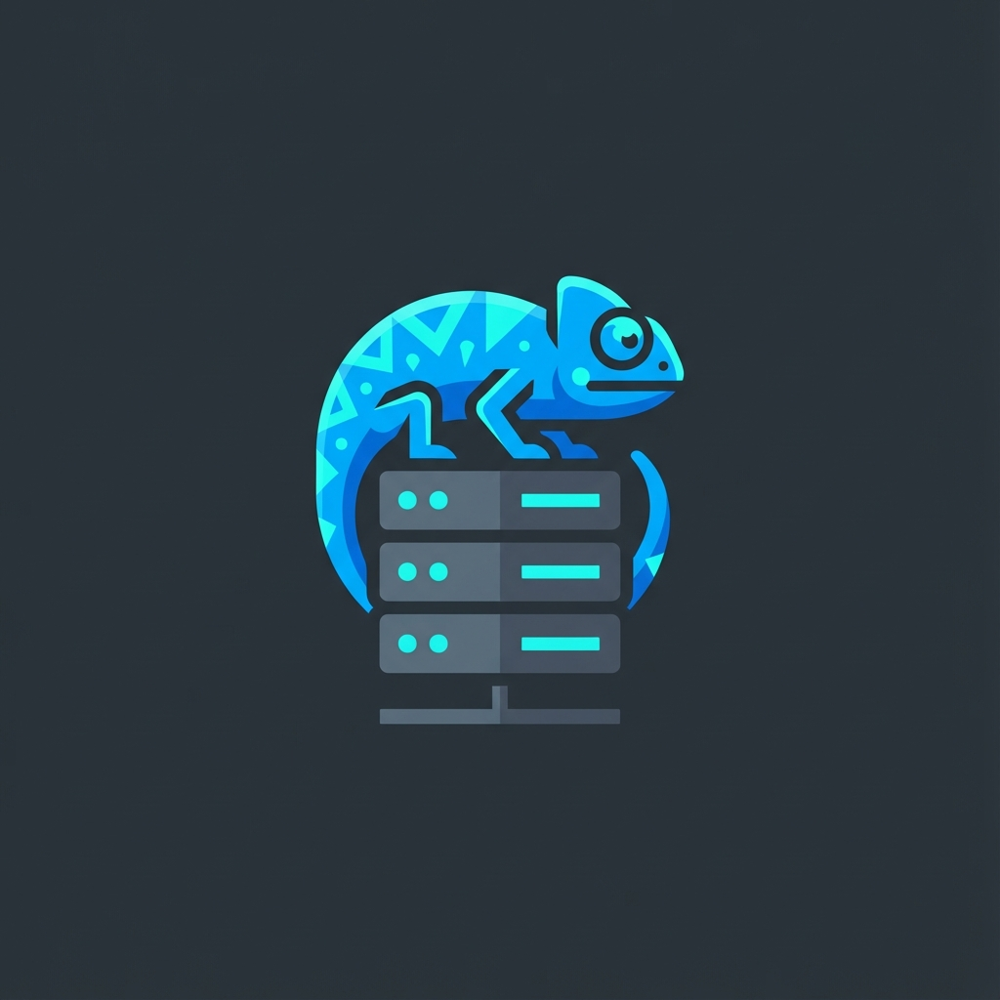
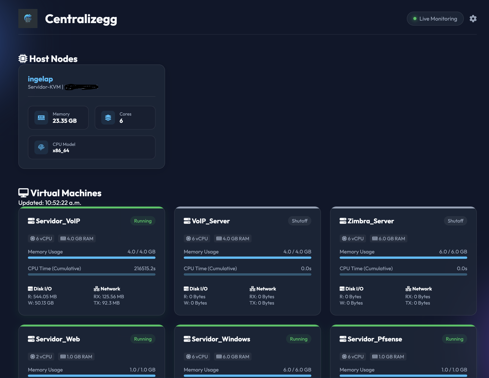

# Centralizegg

<div align="center">
  
</div>

<div align="center">
  
</div>


 [🇨🇴 Español](#español) | [🇺🇸 English](#english)

<a name="español"></a>
# 🇨🇴 Centralizegg

**Centralizegg** es una solución de monitoreo ligera y containerizada para múltiples servidores KVM. Proporciona un dashboard premium en tiempo real para visualizar los recursos de tus hosts y el estado de las máquinas virtuales (VMs) de forma centralizada.

## ✨ Características Principales
*   **Soporte Multi-Servidor**: Gestiona múltiples nodos KVM desde una sola interfaz.
*   **Indicadores de Estado**: Visualiza qué servidores están 🟢 Online o 🔴 Offline.
*   **Detalles de VM**: Consulta vCPU, Memoria configurada y uso en tiempo real.
*   **Métricas de I/O**: Monitoreo en tiempo real de Lectura/Escritura de Disco y RX/TX de Red.
*   **Web-Based Config**: Añade o elimina servidores directamente desde el dashboard.
*   **Seguridad**: Soporte para puertos SSH personalizados y autenticación por contraseña.

## 🚀 Instalación Rápida

### Requisitos Previos
*   Docker y Docker Compose.
*   Acceso SSH (vía clave o contraseña) a los servidores KVM.

### Configuración de Seguridad (SSH)
Para que **Centralizegg** se conecte a tus servidores, necesita tu clave privada SSH.
1. Asegúrate de que tu clave está en `~/.ssh/id_rsa`.
2. El contenedor monta este directorio como solo lectura por defecto.

### Despliegue
```bash
docker-compose up -d --build
```
Accede al dashboard en: `http://localhost:8080`

---

<a name="english"></a>
# 🇺🇸 Centralizegg

**Centralizegg** is a lightweight, containerized monitoring solution for multiple KVM servers. It provides a premium, real-time dashboard to visualize host resources and VM states from a centralized location.

## ✨ Key Features
*   **Multi-Server Support**: Manage multiple KVM nodes from a single interface.
*   **Status Indicators**: See which servers are 🟢 Online or 🔴 Offline.
*   **VM Details**: View vCPU, configured Memory, and real-time usage.
*   **I/O Metrics**: Real-time monitoring for Disk Read/Write and Network RX/TX.
*   **Web-Based Config**: Add or remove servers directly from the dashboard.
*   **Security**: Support for custom SSH ports and password authentication.

## 🚀 Quick Start

### Prerequisites
*   Docker and Docker Compose.
*   SSH access (key or password) to KVM servers.

### Security Setup (SSH)
For **Centralizegg** to connect to your servers, it needs your private SSH key.
1. Ensure your key is at `~/.ssh/id_rsa`.
2. The container mounts this directory as read-only by default.

### Deployment
```bash
docker-compose up -d --build
```
Access the dashboard at: `http://localhost:8080`

## 🛠️ Tech Stack
*   **Backend**: Go (Golang) + Libvirt + SSH.
*   **Database**: PostgreSQL.
*   **Frontend**: Vanilla JS + CSS (Glassmorphism design).
*   **Deployment**: Docker Compose.

---
© 2026 Centralizegg Contributors - MIT License
