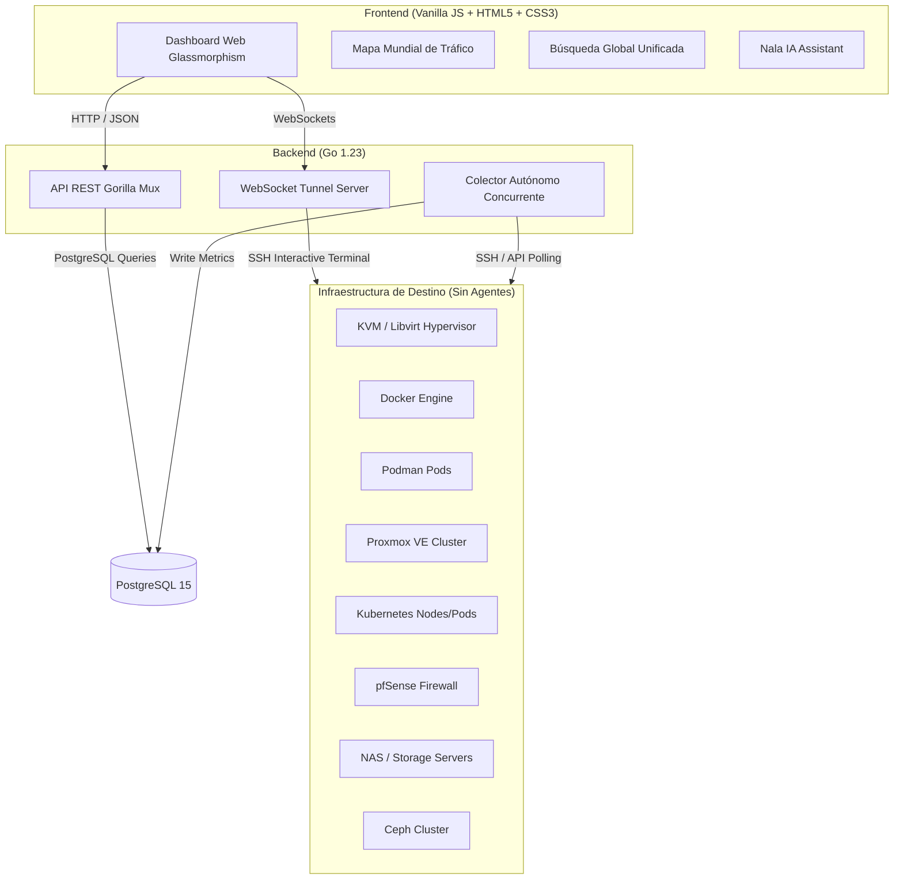
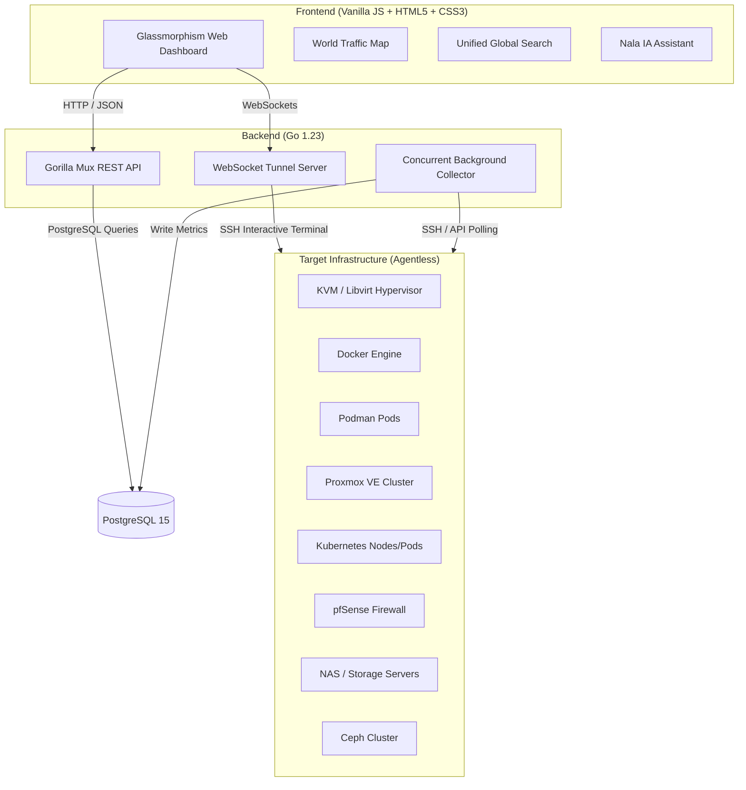
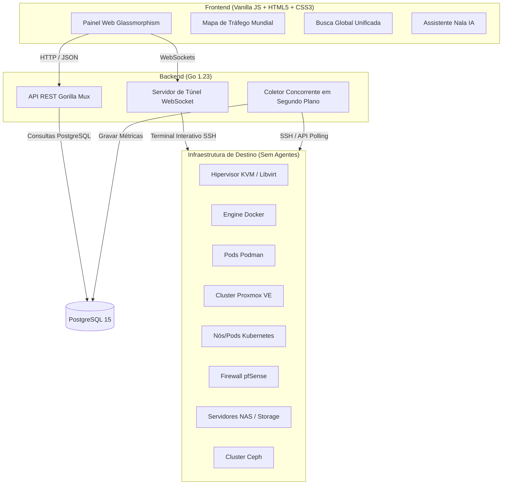

<!-- START_BADGES -->
<div align="center">
  
  
  
  
</div>
<!-- END_BADGES -->

#  Centralizegg

<div align="center">
  <p>
    <a href="#español">🇨🇴 Español</a> | 
    <a href="#english">🇺🇸 English</a> | 
    <a href="#português">🇧🇷 Português</a>
  </p>
</div>

---

<h2 id="español">🇨🇴 Español</h2>

**Centralizegg** es una solución de monitoreo ligera, modular y containerizada diseñada para entornos de múltiples servidores y servicios. Proporciona un panel de control (dashboard) interactivo premium en tiempo real con estética *glassmorphism* que centraliza la visualización de recursos de hosts KVM/Libvirt, contenedores Docker & Podman, clústeres Kubernetes, cortafuegos pfSense, nodos Proxmox VE, almacenamiento NAS y clústeres Ceph.

### 🌟 Características Principales
*   **Monitoreo Multicloud y Multiplataforma**: Soporte nativo y sin agentes para KVM, Docker, Podman (representado con el icono `fa-otter`), pfSense, Proxmox VE, Kubernetes, NAS y Ceph.
*   **Visualizaciones Premium en Tiempo Real**: Gráficos de red dinámicos con *Sparklines*, mapas de topología animados para contenedores y mapas interactivos de tráfico mundial con trayectorias Bezier.
*   **Auditorías y Alertas Audibles**: Motor de alertas integrado que reproduce alertas sonoras ("ping") ante caídas de infraestructura crítica.
*   **Asistente IA Hiper-Contextualizado (Nala IA)**: Asistente integrado que recopila el estado actual del clúster (CPU, RAM, estado) en su prompt de sistema para brindar soporte técnico inmediato.
*   **Consola Web Segura**: Terminal web interactiva en vivo usando WebSockets y XTerm.js integrada directamente en el dashboard.

### 🏗️ Arquitectura Técnica de Alto Nivel


### 🔄 Diagrama de Secuencia de Recolección de Métricas

```mermaid
sequenceDiagram
    autonumber
    participant C as Colector (Go Routine)
    participant DB as PostgreSQL 15
    participant PVE as Nodo Proxmox VE
    participant PFS as pfSense Firewall

    rect rgb(20, 20, 30)
        note right of C: Ciclo cada 5 segundos
        C->>DB: Obtener servidores Proxmox y pfSense configurados
        DB-->>C: Lista de credenciales y direcciones IP
    end

    par Proxmox Collection
        C->>PVE: Conexión SSH y comando 'pvesh get /cluster/status'
        PVE-->>C: JSON con nombres de nodos e IPs reales de clúster
        C->>PVE: Comando 'pvesh get /nodes/{node}/status'
        PVE-->>C: Telemetría de CPU, Memoria y discos
        C->>DB: UpsertProxmoxHost con IP real e información de hardware
    and pfSense Collection
        C->>PFS: Conexión SSH y consulta de comando 'top / sysctl'
        PFS-->>C: Estado de interfaces, gateways y hardware
        C->>DB: UpdateGenericServerStats para pfSense
    end
```


### 💻 Stack Tecnológico
| Capa / Layer | Tecnología / Technology | Descripción / Description |
| :--- | :--- | :--- |
| **Frontend** | Vanilla JS / CSS3 (Glassmorphism) | Interfaz web responsiva, optimizada para rendimiento y sin frameworks pesados. |
| **Backend** | Go (Golang) 1.23.2 | Servidor API rápido, eficiente, con soporte nativo de concurrencia para el colector. |
| **Base de Datos** | PostgreSQL 15 | Almacenamiento relacional de configuraciones e historial de métricas estructurado en esquemas. |
| **Redes / Mapas** | Leaflet.js / D3.js | Motor de mapas interactivos para geolocalización de tráfico y diagramas de topología de red. |

### 📋 Requisitos Previos
*   Docker y Docker Compose instalados en tu sistema local.
*   Credenciales SSH (llave privada RSA/Ed25519 o contraseña) para servidores remotos.
*   Acceso a internet para la geolocalización IP en el Mapa Mundial.

### 🛠️ Instrucciones de Despliegue
1. Clone el repositorio:
   ```bash
   git clone https://github.com/grs89/centralizegg.git
   cd centralizegg
   ```
2. Asegúrese de que sus claves SSH privadas en `~/.ssh/` posean permisos estrictos:
   ```bash
   chmod 600 ~/.ssh/id_rsa
   ```

### ⚡ Inicio Rápido (Quick Start)
Para iniciar Centralizegg localmente usando Docker Compose:
```bash
docker-compose up -d --build
```
Una vez levantado, abra su navegador web en `http://localhost:8080`.

### 🧪 Ejecución de Pruebas
Puedes ejecutar el conjunto de pruebas unitarias implementadas para el backend de Go con:
```bash
go test ./...
```

### 📄 Licencia
Este proyecto está licenciado bajo la **Licencia MIT**. Ver el archivo [LICENSE](LICENSE) para más detalles.

---

<h2 id="english">🇺🇸 English</h2>

**Centralizegg** is a lightweight, modular, and containerized monitoring solution designed for multi-server and multi-service environments. It provides a premium interactive real-time dashboard with *glassmorphism* aesthetics that centralizes resource visualization for KVM/Libvirt hosts, Docker & Podman containers, Kubernetes clusters, pfSense firewalls, Proxmox VE nodes, NAS storage, and Ceph clusters.

### 🌟 Key Features
*   **Automated Multicloud & Multiplatform Monitoring**: Agentless native support for KVM, Docker, Podman (represented with the `fa-otter` icon), pfSense, Proxmox VE, Kubernetes, NAS, and Ceph.
*   **Premium Real-Time Visualizations**: Dynamic network graphs with *Sparklines*, animated container topology maps, and interactive world traffic maps with Bezier paths.
*   **Audits & Audible Alerts**: Integrated alerting engine that plays audio signals ("ping") when critical infrastructure goes offline.
*   **Hyper-Contextualized AI Assistant (Nala IA)**: Integrated chatbot assistant that reads current cluster statuses (CPU, RAM, states) inside its system prompt to deliver instant technical solutions.
*   **Secure Web Console**: Live interactive web terminal powered by WebSockets and XTerm.js integrated directly into the dashboard.

### 🏗️ High-Level Technical Architecture


### 🔄 Metrics Collection Sequence Diagram

```mermaid
sequenceDiagram
    autonumber
    participant C as Collector (Go Routine)
    participant DB as PostgreSQL 15
    participant PVE as Proxmox VE Node
    participant PFS as pfSense Firewall

    rect rgb(20, 20, 30)
        note right of C: Cycle every 5 seconds
        C->>DB: Fetch configured Proxmox and pfSense servers
        DB-->>C: List of credentials and IP addresses
    end

    par Proxmox Collection
        C->>PVE: SSH connection & 'pvesh get /cluster/status' command
        PVE-->>C: JSON containing node names and real cluster IPs
        C->>PVE: Command 'pvesh get /nodes/{node}/status'
        PVE-->>C: CPU, Memory, and Disk telemetry
        C->>DB: UpsertProxmoxHost with real IP and hardware info
    and pfSense Collection
        C->>PFS: SSH connection & 'top / sysctl' commands
        PFS-->>C: Interfaces, Gateways, and Hardware status
        C->>DB: UpdateGenericServerStats for pfSense
    end
```


### 💻 Technology Stack
| Layer | Technology / Tool | Description |
| :--- | :--- | :--- |
| **Frontend** | Vanilla JS / CSS3 (Glassmorphism) | Responsive web interface, optimized for fast performance without heavy frameworks. |
| **Backend** | Go (Golang) 1.23.2 | Fast, efficient API server with native concurrency support for background metric gathering. |
| **Database** | PostgreSQL 15 | Relational storage for configurations and metric history structured in modules. |
| **Network / Maps** | Leaflet.js / D3.js | Interactive world map for traffic geolocation and network topology visualization. |

### 📋 Prerequisites
*   Docker and Docker Compose installed on your local host.
*   SSH Credentials (RSA/Ed25519 private key or password) to access target hosts.
*   Internet access for world map IP geolocations.

### 🛠️ Deployment Instructions
1. Clone the repository:
   ```bash
   git clone https://github.com/grs89/centralizegg.git
   cd centralizegg
   ```
2. Ensure your private SSH keys in `~/.ssh/` have strict permissions set:
   ```bash
   chmod 600 ~/.ssh/id_rsa
   ```

### ⚡ Quick Start
To spin up Centralizegg locally using Docker Compose:
```bash
docker-compose up -d --build
```
Once initialized, visit the web dashboard at `http://localhost:8080`.

### 🧪 Running Tests
You can run the Go unit test suite configured for the backend with:
```bash
go test ./...
```

### 📄 License
This project is licensed under the **MIT License**. Check the [LICENSE](LICENSE) file for more details.

---

<h2 id="português">🇧🇷 Português</h2>

**Centralizegg** é uma solução de monitoramento leve, modular e containerizada projetada para ambientes de múltiplos servidores e serviços. Ele fornece um painel de controle interativo premium em tempo real com estética *glassmorphism* que centraliza a visualização de recursos de hosts KVM/Libvirt, containers Docker & Podman, clusters Kubernetes, firewalls pfSense, nós Proxmox VE, armazenamento NAS e clusters Ceph.

### 🌟 Características Principais
*   **Monitoramento Multicloud e Multiplataforma**: Suporte nativo e sem agentes para KVM, Docker, Podman (representado com o ícone `fa-otter`), pfSense, Proxmox VE, Kubernetes, NAS e Ceph.
*   **Visualizações Premium Em Tempo Real**: Gráficos de rede dinâmicos com *Sparklines*, mapas de topologia animados para containers e mapas interativos de tráfego mundial com trajetórias Bezier.
*   **Auditorias e Alertas Audíveis**: Motor de alertas integrado que reproduz sinais sonoros ("ping") quando a infraestrutura crítica fica offline.
*   **Assistente IA Hiper-Contextualizado (Nala IA)**: Chatbot assistente integrado que lê o estado atual do cluster (CPU, RAM, estados) em seu prompt de sistema para oferecer soluções técnicas imediatas.
*   **Console Web Seguro**: Terminal web interativo em tempo real via WebSockets e XTerm.js integrado diretamente no painel.

### 🏗️ Arquitetura Técnica de Alto Nível


### 🔄 Diagrama de Sequência de Coleta de Métricas


### 💻 Stack Tecnológico
| Camada | Tecnologia / Ferramenta | Descrição |
| :--- | :--- | :--- |
| **Frontend** | Vanilla JS / CSS3 (Glassmorphism) | Interface web responsiva, otimizada para alto desempenho sem frameworks pesados. |
| **Backend** | Go (Golang) 1.23.2 | Servidor API rápido e eficiente com suporte nativo à concorrência para coleta em background. |
| **Banco de Dados** | PostgreSQL 15 | Armazenamento relacional de configurações e histórico de métricas estruturado em esquemas. |
| **Redes / Mapas** | Leaflet.js / D3.js | Motor de mapas interativos para geolocalização de tráfego e mapa de topologia de rede. |

### 📋 Requisitos Prévios
*   Docker e Docker Compose instalados no sistema local.
*   Credenciais SSH (chave privada RSA/Ed25519 ou senha) para acessar os hosts alvo.
*   Acesso à internet para geolocalização de IP no Mapa Mundial.

### 🛠️ Instruções de Implantação
1. Clone o repositório:
   ```bash
   git clone https://github.com/grs89/centralizegg.git
   cd centralizegg
   ```
2. Certifique-se de que suas chaves SSH privadas em `~/.ssh/` tenham permissões estritas:
   ```bash
   chmod 600 ~/.ssh/id_rsa
   ```

### ⚡ Início Rápido
Para levantar o Centralizegg localmente usando o Docker Compose:
```bash
docker-compose up -d --build
```
Uma vez inicializado, acesse o painel web em `http://localhost:8080`.

### 🧪 Executando Testes
Você pode rodar os testes unitários em Go configurados no backend com:
```bash
go test ./...
```

### 📄 Licencia
Este projeto é distribuído sob a **Licença MIT**. Veja o arquivo [LICENSE](LICENSE) para obter mais detalhes.
