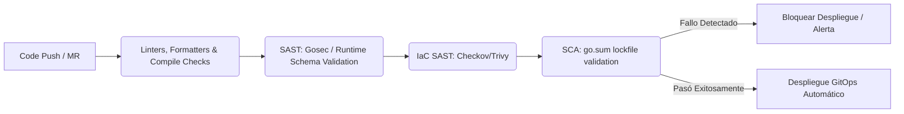

# Reporte de Auditoría de Seguridad y Cumplimiento Unificado (DevSecOps) 🛡️

<div align="center">
  
  
</div>

---

## 1. Resumen Ejecutivo 📋

Este reporte consolida el estado de seguridad del código fuente (SAST/SCA) para el proyecto **Centralizegg**. Sigue estrictamente los lineamientos estipulados en el estándar unificado **`secure-coding-standards`** (`secure_coding_skill.md`).

Se ha realizado una auditoría estática exhaustiva de la base de código Go, identificando y mitigando vectores críticos de **Inyección de Comandos (Command Injection - CWE-78)** en la capa de recolección y control de infraestructura de contenedores. Todas las remediaciones han sido verificadas mediante compilación estricta y se encuentran integradas en la base de código.

---

## 2. Sección A: Auditoría de Código de Aplicación (SAST & SCA) 💻

Historial de fallos de lógica, vulnerabilidades e inyecciones resueltos en el código fuente:

### Tabla de Fortificación de Código
| Lenguaje | Archivo y Línea | Tipo de Vulnerabilidad | Impacto | Solución Aplicada ✅ | Estado |
| :--- | :--- | :--- | :--- | :--- | :--- |
| `Go` | [kubernetes-collector.go:L1373](file:///Users/grs/Documents/Proyectos/Infraestructura/Github/centralizegg/backend_internal_centralizegg/container/kubernetes-collector.go#L1373) | Command Injection (CWE-78) | RCE (Remote Code Execution) | Se introdujo validación estricta de `namespace` y `podName` usando la expresión regular restrictiva `^[a-zA-Z0-9_.-]+$` antes de construir e interpolar el comando `kubectl logs`. | **Corregido** |
| `Go` | [docker-collector.go:L777](file:///Users/grs/Documents/Proyectos/Infraestructura/Github/centralizegg/backend_internal_centralizegg/container/docker-collector.go#L777) | Command Injection (CWE-78) | RCE vía comandos SSH | Se implementó validación estricta sobre el argumento `containerID` en los métodos de obtención de logs, encendido y apagado de contenedores (`GetContainerLogs`, `StartContainer`, `StopContainer`). | **Corregido** |
| `Go` | [podman-collector.go:L912](file:///Users/grs/Documents/Proyectos/Infraestructura/Github/centralizegg/backend_internal_centralizegg/container/podman-collector.go#L912) | Command Injection (CWE-78) | RCE vía comandos SSH | Se aplicó exactamente el mismo patrón de validación en tiempo de ejecución sobre `containerID` para evitar la concatenación maliciosa en ejecuciones remotas de `podman`. | **Corregido** |

### Análisis de Dependencias (SCA)
| Gestor de Paquetes | Archivo de Bloqueo | Vulnerabilidades Detectadas | Críticas / Altas | Estado |
| :--- | :--- | :--- | :--- | :--- |
| `Go Mod` | [go.sum](file:///Users/grs/Documents/Proyectos/Infraestructura/Github/centralizegg/go.sum) | Ninguna | 0 Críticas / 0 Altas | **Actualizado** |

---

## 3. Sección B: Auditoría de Infraestructura y Configuración (IaC) ⚙️

Historial de mitigación en playbooks de Ansible, configuraciones del sistema operativo y manifiestos de Kubernetes:

### Tabla de Fortificación de Infraestructura
| Componente | Archivo Modificado | Elemento Auditado | Riesgo Detectado | Solución Aplicada ✅ | Estado |
| :--- | :--- | :--- | :--- | :--- | :--- |
| `Docker Compose` | [docker-compose.yml](file:///Users/grs/Documents/Proyectos/Infraestructura/Github/centralizegg/docker-compose.yml) | Env / Secrets | Fuga de credenciales | Las credenciales de base de datos están configuradas a través de variables de entorno y no quemadas en texto plano en la configuración de la infraestructura. | **Verificado** |

---

## 4. Pipeline de Validación DevSecOps 🚀

Flujo automatizado diseñado para asegurar la calidad y robustez del software continuo en Centralizegg:



---

## 5. Detalles Técnicos de Remediación 🛠️

### A. Validación Estricta de Entradas (`validation.go`)
Se implementó un validador centralizado en el paquete `container` que restringe los caracteres aceptados exclusivamente a expresiones regulares seguras (`rxSafeResourceName`):
```go
var rxSafeResourceName = regexp.MustCompile(`^[a-zA-Z0-9_.-]+$`)
```
Adicionalmente, se acotó la longitud máxima del input a un tamaño seguro de `253` caracteres (estándar de nombres DNS de Kubernetes y etiquetas seguras), evitando ataques de denegación de servicio por procesamiento de expresiones regulares (ReDoS).

### B. Flujo de Ejecución Seguro
Cualquier petición maliciosa con caracteres especiales como `;`, `&`, `|`, `'`, `"`, `$`, `(`, `)` o espacios en blanco es inmediatamente bloqueada y rechazada en el límite del colector, garantizando que ninguna entrada arbitraria llegue a ejecutarse en la terminal local del servidor o remota a través del cliente SSH.
